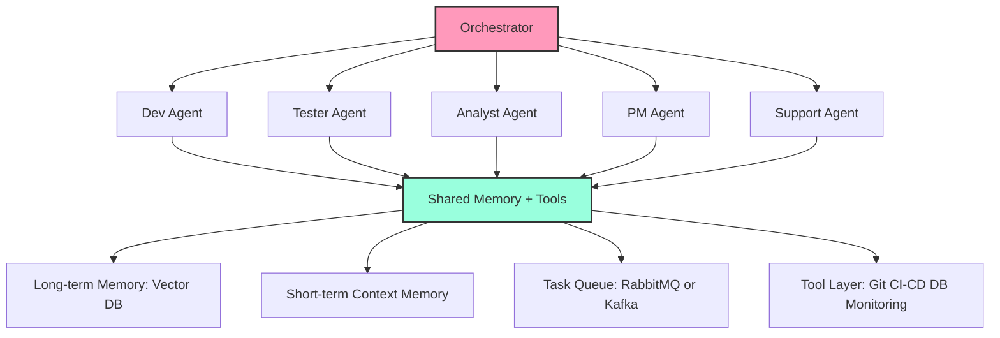
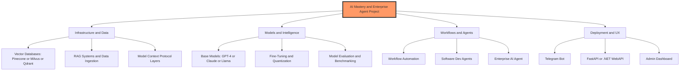

# FineTuningWithLLaMa

Bu repo iki ana parcayi birlestirir:

1. Colab uzerinde fine-tuning notebook'u
2. Markdown tabanli AI OS (not, roadmap, proje ve kaynak sistemi)

Aktif model ornegi: MiniMaxAI/MiniMax-M2.5

## Yeni Ogrenimler: MiniMax Agent Team Yaklasimi

Bu bolum, son ogrenim notlarinin ozetidir. Ana fikir: tek bir model degil, model + orchestrator + memory + tools + task sistemi ile AI organizasyonu kurmak.

### Kisa Sonuc

1. MiniMax yaklasimi, role-based multi-agent ekipler icin guclu bir temel sagliyor.
2. Self-improvement dongusu ile sistem kendi performansini otomatik artirabiliyor.
3. Basari model seciminden cok sistem mimarisine bagli.

### Ogrenim Linkleri (Alt Notlar)

- [ai-system/insights/01-agent-self-evolution.md](ai-system/insights/01-agent-self-evolution.md)
- [ai-system/insights/02-agent-harness.md](ai-system/insights/02-agent-harness.md)
- [ai-system/insights/03-rl-team-workflow.md](ai-system/insights/03-rl-team-workflow.md)
- [ai-system/insights/04-self-improvement-loop.md](ai-system/insights/04-self-improvement-loop.md)
- [ai-system/insights/05-agent-teams-native.md](ai-system/insights/05-agent-teams-native.md)
- [ai-system/insights/06-production-debugging.md](ai-system/insights/06-production-debugging.md)
- [ai-system/insights/07-office-cs-agents.md](ai-system/insights/07-office-cs-agents.md)
- [ai-system/insights/08-self-learning-core.md](ai-system/insights/08-self-learning-core.md)
- [ai-system/insights/09-system-architecture.md](ai-system/insights/09-system-architecture.md)
- [ai-system/insights/10-model-fit-and-limits.md](ai-system/insights/10-model-fit-and-limits.md)

### Mimari Ozet (Hedef Sistem)

## Hizli Baslangic

1. [example_colab_finetune_llama.ipynb](example_colab_finetune_llama.ipynb) dosyasini Colab'de ac.
2. GPU runtime secip hucreleri sirayla calistir.
3. AI OS klasorunu bu README altindaki linkler uzerinden yonet.

## AI Master Plan (Mermaid)

## Obsidian Baglama

Obsidian'i bu repo ile birlikte kullanmak icin:

1. Obsidian -> Open folder as vault
2. Bu repo kok klasorunu sec
3. Ozellikle [ai-system](ai-system) altindaki markdown dosyalarini yonet
4. Notlar arasinda `[[wiki-link]]` kullan
5. Degisiklikleri Git ile commit edip push et

Not: `.obsidian` klasorunu repoya eklemek zorunlu degil. Cihaz ozel ayarlari local kalabilir.

## Neden LoRA?

1. Colab ortamina daha uygun bellek kullanimi
2. Tam fine-tuning'e gore daha hizli iterasyon
3. Kucuk adapter dosyalari ile daha kolay tasima ve versiyonlama

## Model Nerde Tutulmali?

Onerilen pratik:

1. GitHub: kod, notebook, metrik, dokuman
2. Harici depolama: model agirliklari (Hugging Face Hub, Drive, blob storage)

`models/` klasoru mantikli mi?

1. Sadece kucuk LoRA adapterlari icin evet
2. Tam model checkpointleri icin hayir
3. Mecbursa Git LFS kullan

## MiniMax-M2.5 Notu

MiniMax-M2.5 bazi Colab GPU tiplerinde VRAM sinirina takilabilir.
Gerektiginde daha guclu runtime sec veya daha kucuk modelle devam et.

## Aktif Sprint

- [Sprint 1 - Mart 2026](ai-system/sprints/sprint-1-march.md)

## Repo Icerigi

- [ai-system/sprints/sprint-1-march.md](ai-system/sprints/sprint-1-march.md): Sprint 1 - Mart 2026
- [example_colab_finetune_llama.ipynb](example_colab_finetune_llama.ipynb): Veri yukleme, egitme, cikti kaydetme
- [ai-system/roadmap/01-foundations.md](ai-system/roadmap/01-foundations.md)
- [ai-system/roadmap/02-agents.md](ai-system/roadmap/02-agents.md)
- [ai-system/roadmap/03-finetuning.md](ai-system/roadmap/03-finetuning.md)
- [ai-system/roadmap/04-rag.md](ai-system/roadmap/04-rag.md)
- [ai-system/roadmap/05-enterprise.md](ai-system/roadmap/05-enterprise.md)
- [ai-system/notes/ollama.md](ai-system/notes/ollama.md)
- [ai-system/notes/vector-db.md](ai-system/notes/vector-db.md)
- [ai-system/notes/mcp.md](ai-system/notes/mcp.md)
- [ai-system/projects/telegram-agent.md](ai-system/projects/telegram-agent.md)
- [ai-system/projects/n8n-ai-workflows.md](ai-system/projects/n8n-ai-workflows.md)
- [ai-system/projects/enterprise-ai.md](ai-system/projects/enterprise-ai.md)
- [ai-system/resources/links.md](ai-system/resources/links.md)
- [ai-system/resources/note-template.md](ai-system/resources/note-template.md)
- [ai-system/insights/01-agent-self-evolution.md](ai-system/insights/01-agent-self-evolution.md)
- [ai-system/insights/02-agent-harness.md](ai-system/insights/02-agent-harness.md)
- [ai-system/insights/03-rl-team-workflow.md](ai-system/insights/03-rl-team-workflow.md)
- [ai-system/insights/04-self-improvement-loop.md](ai-system/insights/04-self-improvement-loop.md)
- [ai-system/insights/05-agent-teams-native.md](ai-system/insights/05-agent-teams-native.md)
- [ai-system/insights/06-production-debugging.md](ai-system/insights/06-production-debugging.md)
- [ai-system/insights/07-office-cs-agents.md](ai-system/insights/07-office-cs-agents.md)
- [ai-system/insights/08-self-learning-core.md](ai-system/insights/08-self-learning-core.md)
- [ai-system/insights/09-system-architecture.md](ai-system/insights/09-system-architecture.md)
- [ai-system/insights/10-model-fit-and-limits.md](ai-system/insights/10-model-fit-and-limits.md)
